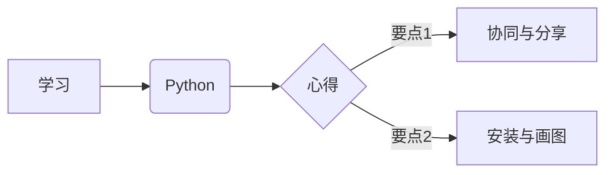

# 心得

```mermaid
graph LR
A[学习] -->B(Python)
    B --> C{心得}
    C -->|要点1| D[协同与分享]
    C -->|要点2| E[安装与画图]
```
# 体会
工作| 进度 |  预期| 
-|-|-
Python | 了解基本语法 | 掌握绘图与表格制作工具 |
Jupyter |了解使用方法| 完成课堂作业与实践 |
Algorithm | 熟悉嵌入平台 | 基于PYNG |
