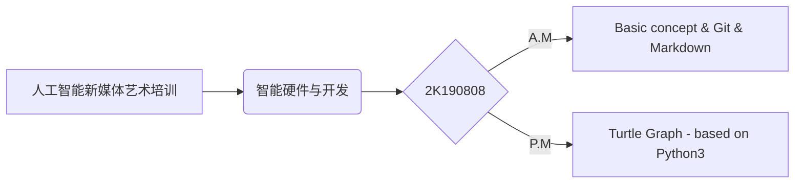

# 葛晓扬-学习日志

|项目|内容|
|--|--|
| 课程名 | 人工智能新媒体艺术培训—智能硬件与开发 |
| 日期 | 2K19-08-08 |
| 地点 | iCenter 5F |

|项目|内容|
|--|--|
|“智能”概念|Smart vs Artificial Intelligence|
|"智能"应用|“智能”音响（家庭终端）等|
|Git|下载→注册→上传文档→团队协作→管理与合并项目|
|Typora|Markdown语法学习|
||标题、正文、图片、表格、流程图|

